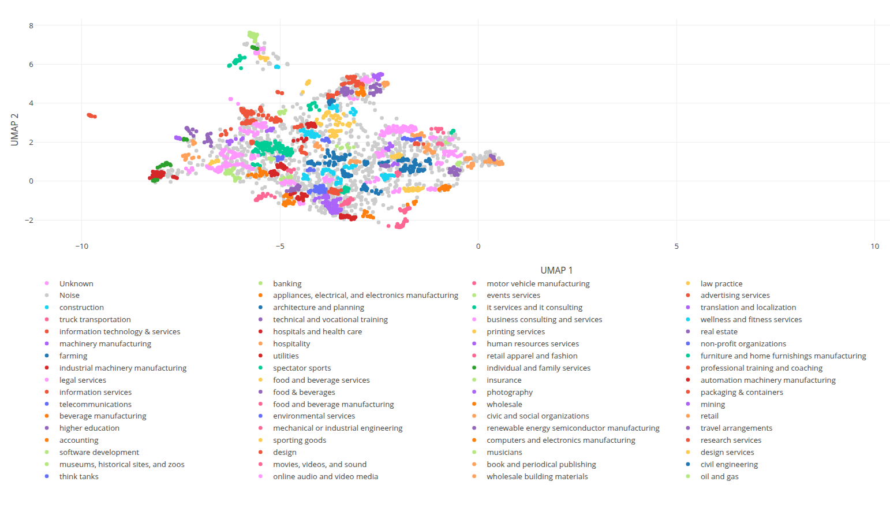
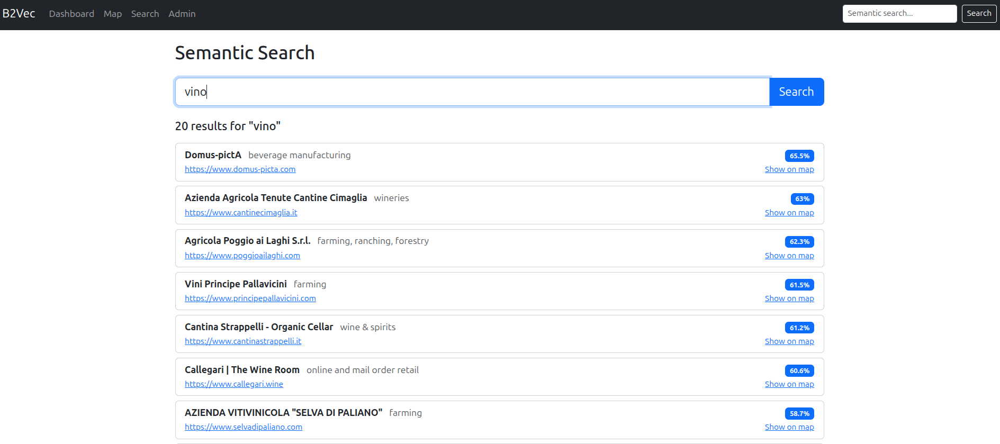

# B2Vec

**Semantic business map** — explore and discover companies through vector similarity.

B2Vec scrapes company websites, encodes their content with SBERT, projects embeddings into 2D with UMAP, clusters them with HDBSCAN, and lets you explore everything on an interactive Plotly.js map with semantic search.

Live at [b2vec.org](https://b2vec.org)

Inspired by the paper: [Company2Vec](https://arxiv.org/pdf/2307.09332)

Project explanation (ITA): [YouTube](https://youtu.be/Prr1o_zfY3k)

## Screenshots

**Cluster map** — companies projected in 2D, colored by HDBSCAN cluster



**Similar companies** — click any point to find the most similar businesses


**Semantic search** — search by concept, not keywords



## How it works

```
CSV (268k companies)
  → Web scraping (async, multi-URL retry)
    → SBERT encoding (paraphrase-multilingual-MiniLM-L12-v2, 384d)
      → UMAP projection (2D)
        → HDBSCAN clustering
          → Interactive map + semantic search
```

1. **Scraping** — For each company, tries `https://www.`, `https://`, `http://www.` variants, extracts clean text stripping boilerplate
2. **Embedding** — Chunks long texts (500 chars, 100 overlap), encodes with SBERT, mean-pools per company into a 384-dimensional vector
3. **Projection** — UMAP reduces to 2D for visualization, HDBSCAN assigns cluster labels from dominant industry
4. **Search** — Queries are encoded with the same model and matched via pgvector cosine distance

## Stack

| Layer | Tech |
|---|---|
| Backend | Django 5, Celery, PostgreSQL + pgvector |
| Embeddings | sentence-transformers (MiniLM-L12-v2) |
| Projection | UMAP + HDBSCAN |
| Frontend | Plotly.js, Bootstrap 5.3 |
| Infra | Docker (pgvector:pg16, Redis 7) |

## Quickstart

```bash
# Start PostgreSQL (pgvector) and Redis
docker compose up -d

# Install dependencies
pip install -r requirements.txt

# Run migrations
python manage.py migrate

# Import data from SQLite (if migrating from previous version)
python manage.py migrate_data

# Start Celery worker (separate terminal)
celery -A config worker -l info

# Start Django
python manage.py runserver
```

### Generate embeddings

From the dashboard click **"Generate Embeddings + Projections"**, or from terminal:

```bash
# Synchronous
python manage.py generate_embeddings

# Async (via Celery)
python manage.py generate_embeddings --async

# Projections only (if embeddings already exist)
python manage.py generate_embeddings --projections-only
```

## Pages

| Route | Description |
|---|---|
| `/` | Dashboard — stats, scraping and embedding actions |
| `/map/` | Interactive Plotly.js scatter map with cluster colors, click for similar companies |
| `/search/` | Semantic search — encode query with SBERT, find nearest neighbors via pgvector |
| `/admin/` | Django admin |

## API

| Endpoint | Method | Description |
|---|---|---|
| `/api/map-data/` | GET | All companies with UMAP coordinates and cluster info |
| `/api/similar/<id>/?n=10` | GET | Top N similar companies (pgvector cosine distance) |
| `/api/search/?q=...&n=20` | GET | Semantic search by text query |
| `/api/company/<id>/` | GET | Company detail |

## Dataset

This project uses the [BigPicture Free Company Dataset](https://docs.bigpicture.io/docs/free-datasets/companies/), which contains over 17 million global companies with fields: company name, domain, website, LinkedIn industry, size, type, founding year, city, state, and country.

The dataset is available for free (account required) and released under the [Open Data Commons Attribution License (ODC-By)](https://opendatacommons.org/licenses/by/1.0/).

> Data provided by Big Picture Technologies, Inc. — BigPicture Free Company Dataset, licensed under ODC-By.

**Note:** The dataset is raw — some domains may not resolve, redirect, or may be free email providers (e.g. gmail.com).

## License

MIT
