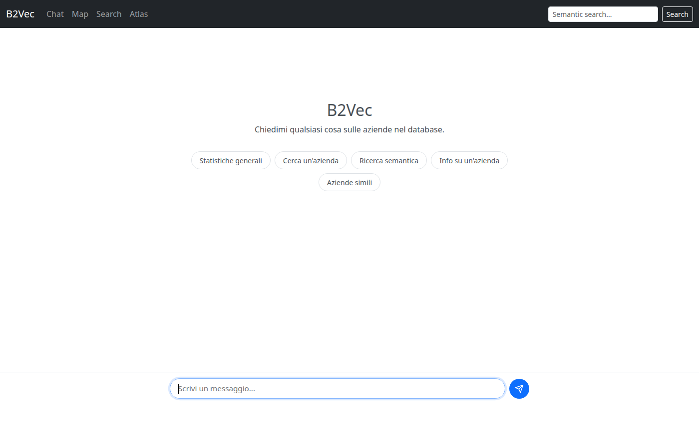
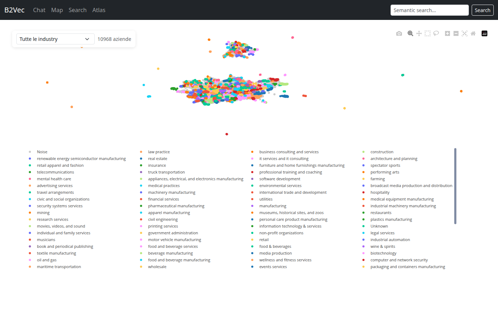
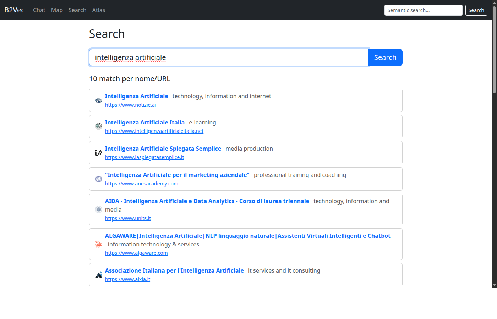
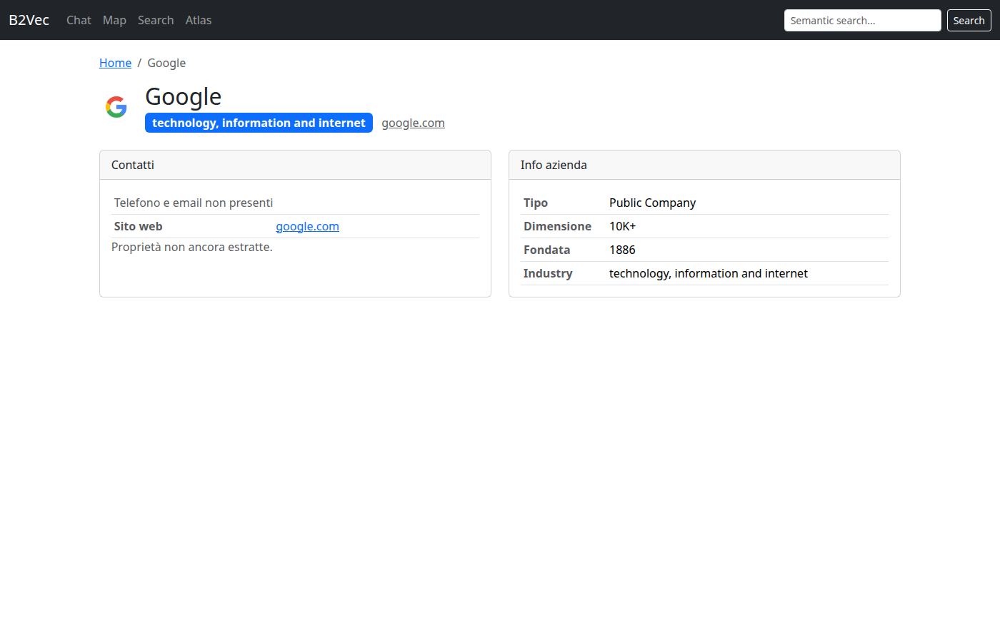

# B2Vec

**Semantic business map** — explore and discover companies through vector similarity.

B2Vec scrapes company websites, encodes their content with embedding models, projects embeddings into 2D with UMAP, clusters them with HDBSCAN, and lets you explore everything on an interactive map with semantic search and an AI chat assistant.

Live at [b2vec.org](https://b2vec.org)

Inspired by the paper: [Company2Vec](https://arxiv.org/pdf/2307.09332)

Project explanation (ITA): [YouTube](https://youtu.be/Prr1o_zfY3k)

## Screenshots

**AI Chat** — ask questions about companies, search semantically, export contacts



**Cluster map** — companies projected in 2D, colored by HDBSCAN cluster, with industry filter



**Search** — text and semantic search across all companies



**Company detail** — contacts, company info, services, and similar companies



## How it works

```
CSV (268k companies)
  → Web scraping (async, multi-URL retry)
    → Embedding (Ollama nomic-embed-text, 768d)
      → UMAP projection (2D)
        → HDBSCAN clustering
          → Interactive map + semantic search + AI chat
```

1. **Scraping** — For each company, tries `https://www.`, `https://`, `http://www.` variants, extracts clean text stripping boilerplate
2. **Embedding** — Chunks long texts (500 chars, 100 overlap), encodes with Ollama embedding model, mean-pools per company
3. **Property extraction** — Ollama LLM extracts structured data (email, phone, VAT, services, description) from scraped text
4. **Projection** — UMAP reduces to 2D for visualization, HDBSCAN assigns cluster labels from dominant industry
5. **Search** — Queries are encoded with the same model and matched via pgvector cosine distance
6. **Chat** — AI assistant powered by Ollama with tool-calling: semantic search, SQL queries, web search, contact export

## Stack

| Layer | Tech |
|---|---|
| Backend | Django 5, PostgreSQL + pgvector |
| LLM / Embeddings | Ollama (qwen2.5, nomic-embed-text) |
| Projection | UMAP + HDBSCAN |
| Frontend | Plotly.js, Bootstrap 5.3 |
| Infra | Docker (pgvector:pg16, Redis 7) |

## Features

- **Interactive map** — Plotly.js scatter plot with UMAP 2D projection, colored by cluster
- **Atlas view** — embedding-atlas large-scale visualization
- **Semantic search** — search companies by concept/description
- **AI Chat** — conversational assistant with tool-calling (semantic search, company lookup, SQL, web search)
- **Contact export** — ask the chat to export contacts by sector → downloadable CSV
- **Company detail** — full info page with description, contacts, services, similar companies

## Quickstart

```bash
# Start PostgreSQL (pgvector) and Redis
docker compose up -d

# Install dependencies
pip install -r requirements.txt

# Run migrations
python manage.py migrate

# Import data from SQLite (if migrating from previous version)
python manage.py migrate_data

# Start Django
python manage.py runserver
```

### Generate embeddings

From the dashboard click **"Generate Embeddings + Projections"**, or from terminal:

```bash
# Synchronous
python manage.py generate_embeddings

# Async (via Celery)
python manage.py generate_embeddings --async

# Projections only (if embeddings already exist)
python manage.py generate_embeddings --projections-only
```

## Pages

| Route | Description |
|---|---|
| `/` | AI Chat — conversational interface with tool-calling |
| `/map/` | Interactive Plotly.js scatter map with cluster colors |
| `/search/` | Semantic search — find companies by description |
| `/atlas/` | Embedding-atlas large-scale visualization |
| `/company/<id>/` | Company detail page |

## API

| Endpoint | Method | Description |
|---|---|---|
| `/api/chat/` | POST | AI chat with streaming SSE (tool calls + token stream) |
| `/api/map-data/` | GET | All companies with UMAP coordinates and cluster info |
| `/api/atlas-data/` | GET | Atlas visualization data |
| `/api/similar/<id>/?n=10` | GET | Top N similar companies (pgvector cosine distance) |
| `/api/search/?q=...&n=20` | GET | Semantic search by text query |
| `/api/text-search/?q=...` | GET | Text search by company name/URL |
| `/api/company/<id>/` | GET | Company detail |
| `/exports/<filename>` | GET | Download exported CSV file |

## Chat tools

The AI chat assistant can use these tools:

| Tool | Description |
|---|---|
| `semantic_search` | Find companies by concept/sector via embedding similarity |
| `search_by_name` | Search companies by name or URL |
| `get_company` | Get full details of a specific company |
| `get_similar` | Find similar companies by embedding distance |
| `get_stats` | Database statistics (counts, top industries/cities) |
| `export_contacts` | Export matching contacts to downloadable CSV |
| `web_search` | Search the web via DuckDuckGo |
| `run_sql` | Execute read-only SQL queries |

## Dataset

This project uses the [BigPicture Free Company Dataset](https://docs.bigpicture.io/docs/free-datasets/companies/), which contains over 17 million global companies with fields: company name, domain, website, LinkedIn industry, size, type, founding year, city, state, and country.

The dataset is available for free (account required) and released under the [Open Data Commons Attribution License (ODC-By)](https://opendatacommons.org/licenses/by/1.0/).

> Data provided by Big Picture Technologies, Inc. — BigPicture Free Company Dataset, licensed under ODC-By.

**Note:** The dataset is raw — some domains may not resolve, redirect, or may be free email providers (e.g. gmail.com).

## License

MIT
